# BeautifulUI live demo gallery

Every preview below plays directly on this GitHub page. GitHub sanitizes inline MP4 players in repository Markdown, so each animated GIF links to its full-quality native MP4 release.

Every capture comes from native SwiftUI in the iPhone demo app. No web view. No browser recording.

[Download complete 81-second reel](https://github.com/unlocalhosted/beautiful-ui-swift/releases/download/0.2.2/BeautifulUI-Primitives-Demo.mp4)

<table>
  <tr>
    <td align="center"><a href="https://github.com/unlocalhosted/beautiful-ui-swift/releases/download/0.2.2/01-Loading-State.mp4">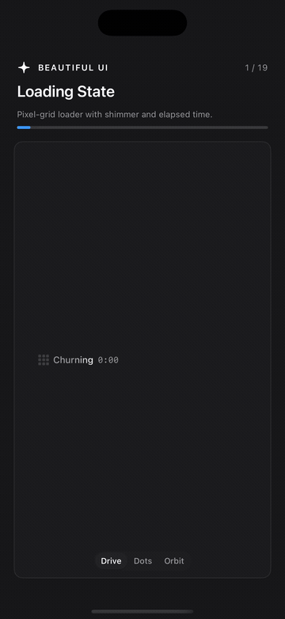<br /><strong>01 · Loading State</strong></a></td>
    <td align="center"><a href="https://github.com/unlocalhosted/beautiful-ui-swift/releases/download/0.2.2/02-Thinking.mp4">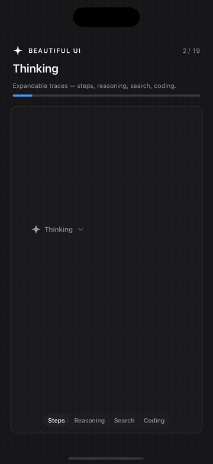<br /><strong>02 · Thinking</strong></a></td>
  </tr>
  <tr>
    <td align="center"><a href="https://github.com/unlocalhosted/beautiful-ui-swift/releases/download/0.2.2/03-Streaming-Text.mp4">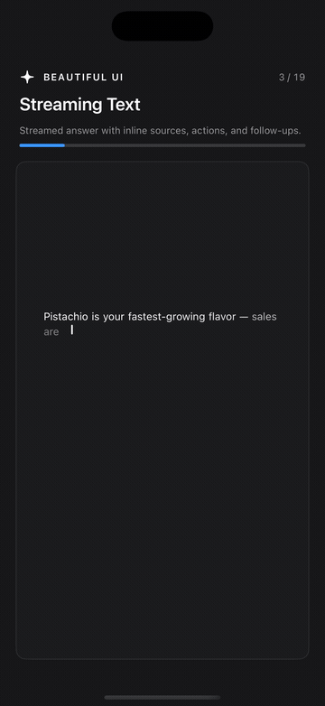<br /><strong>03 · Streaming Text</strong></a></td>
    <td align="center"><a href="https://github.com/unlocalhosted/beautiful-ui-swift/releases/download/0.2.2/04-Approval-Card.mp4">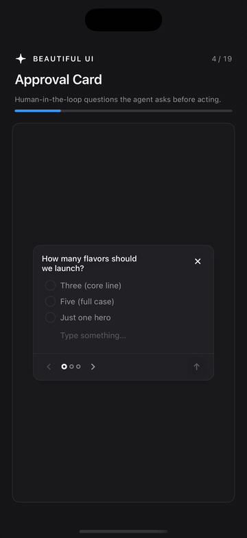<br /><strong>04 · Approval Card</strong></a></td>
  </tr>
  <tr>
    <td align="center"><a href="https://github.com/unlocalhosted/beautiful-ui-swift/releases/download/0.2.2/05-Tool-Chips.mp4">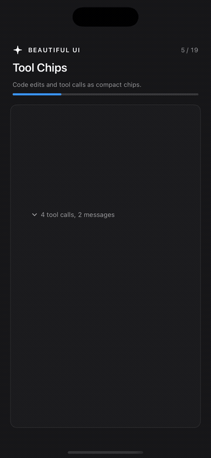<br /><strong>05 · Tool Chips</strong></a></td>
    <td align="center"><a href="https://github.com/unlocalhosted/beautiful-ui-swift/releases/download/0.2.2/06-Task-Rows.mp4">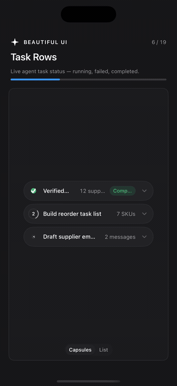<br /><strong>06 · Task Rows</strong></a></td>
  </tr>
  <tr>
    <td align="center"><a href="https://github.com/unlocalhosted/beautiful-ui-swift/releases/download/0.2.2/07-Chat.mp4">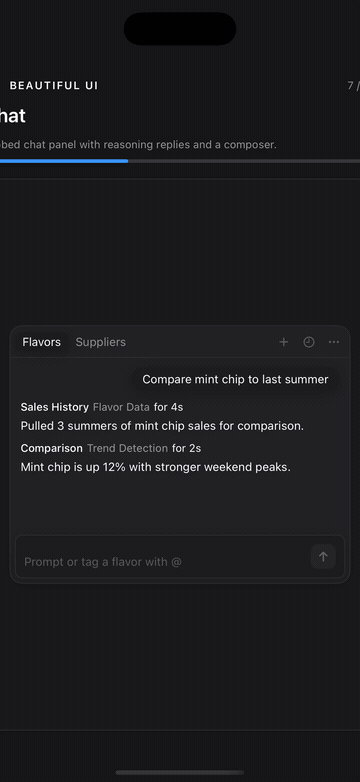<br /><strong>07 · Chat</strong></a></td>
    <td align="center"><a href="https://github.com/unlocalhosted/beautiful-ui-swift/releases/download/0.2.2/08-Prompt-Bar.mp4">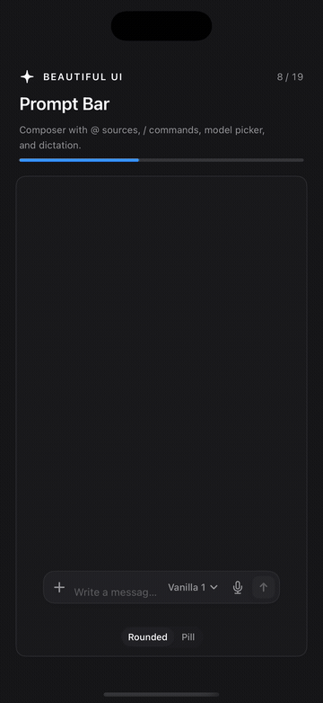<br /><strong>08 · Prompt Bar</strong></a></td>
  </tr>
  <tr>
    <td align="center"><a href="https://github.com/unlocalhosted/beautiful-ui-swift/releases/download/0.2.2/09-Recommendation-Card.mp4">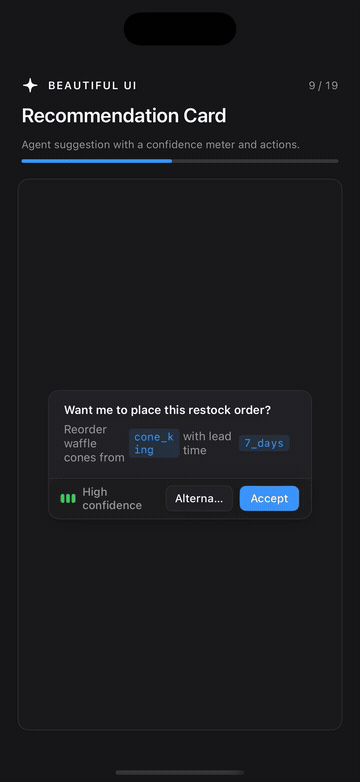<br /><strong>09 · Recommendation Card</strong></a></td>
    <td align="center"><a href="https://github.com/unlocalhosted/beautiful-ui-swift/releases/download/0.2.2/10-Context-Cards.mp4">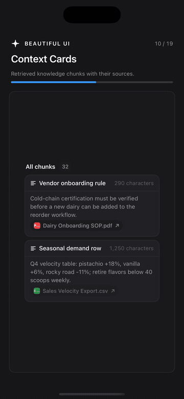<br /><strong>10 · Context Cards</strong></a></td>
  </tr>
  <tr>
    <td align="center"><a href="https://github.com/unlocalhosted/beautiful-ui-swift/releases/download/0.2.2/11-Diff-Table.mp4">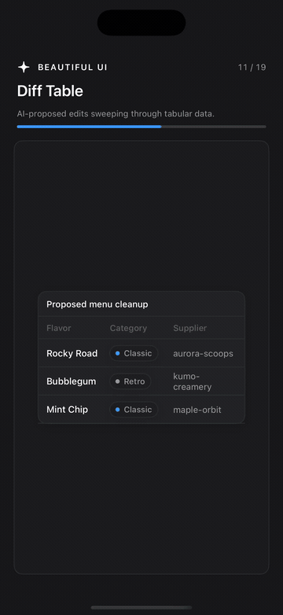<br /><strong>11 · Diff Table</strong></a></td>
    <td align="center"><a href="https://github.com/unlocalhosted/beautiful-ui-swift/releases/download/0.2.2/12-Records-Table.mp4">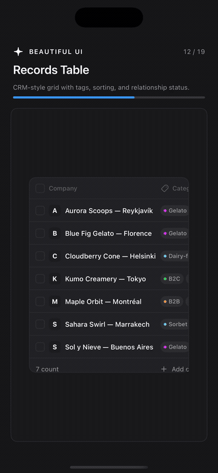<br /><strong>12 · Records Table</strong></a></td>
  </tr>
  <tr>
    <td align="center"><a href="https://github.com/unlocalhosted/beautiful-ui-swift/releases/download/0.2.2/13-Filter-Table.mp4">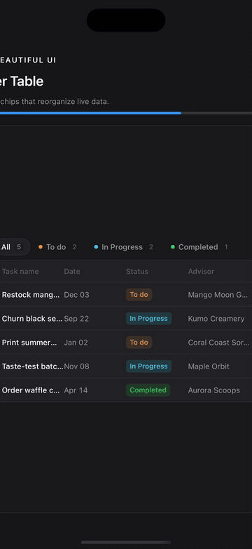<br /><strong>13 · Filter Table</strong></a></td>
    <td align="center"><a href="https://github.com/unlocalhosted/beautiful-ui-swift/releases/download/0.2.2/14-Sidebar-Nav.mp4">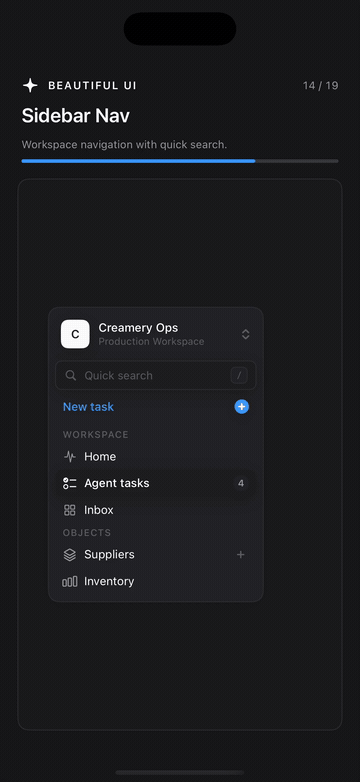<br /><strong>14 · Sidebar Nav</strong></a></td>
  </tr>
  <tr>
    <td align="center"><a href="https://github.com/unlocalhosted/beautiful-ui-swift/releases/download/0.2.2/15-Search.mp4">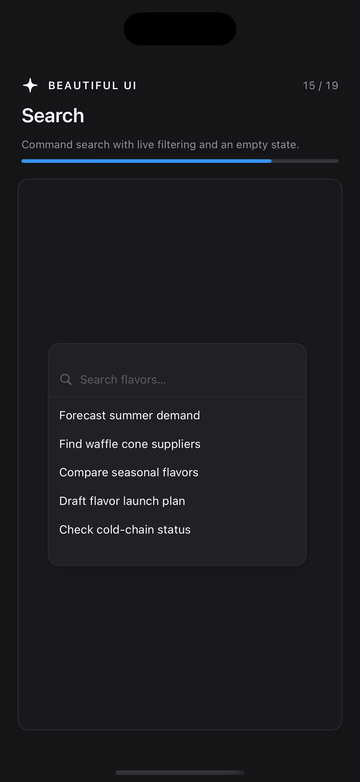<br /><strong>15 · Search</strong></a></td>
    <td align="center"><a href="https://github.com/unlocalhosted/beautiful-ui-swift/releases/download/0.2.2/16-Insight-Cards.mp4">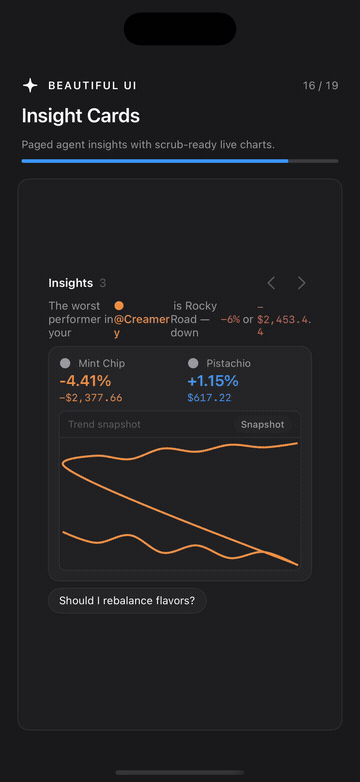<br /><strong>16 · Insight Cards</strong></a></td>
  </tr>
  <tr>
    <td align="center"><a href="https://github.com/unlocalhosted/beautiful-ui-swift/releases/download/0.2.2/17-Code-Block.mp4">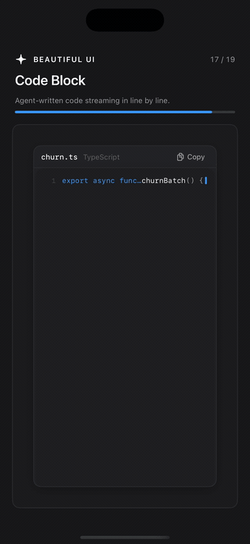<br /><strong>17 · Code Block</strong></a></td>
    <td align="center"><a href="https://github.com/unlocalhosted/beautiful-ui-swift/releases/download/0.2.2/18-Fine-Tune-Card.mp4">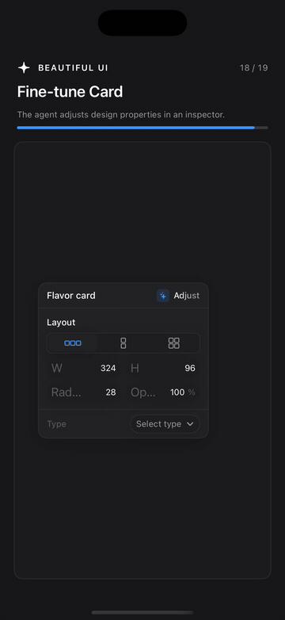<br /><strong>18 · Fine-tune Card</strong></a></td>
  </tr>
  <tr>
    <td align="center"><a href="https://github.com/unlocalhosted/beautiful-ui-swift/releases/download/0.2.2/19-Selection-Actions.mp4">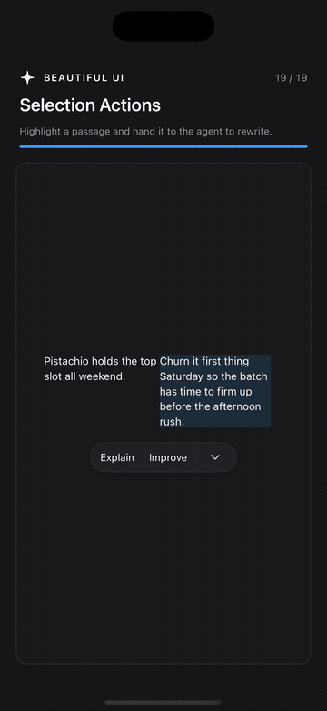<br /><strong>19 · Selection Actions</strong></a></td>
    <td></td>
  </tr>
</table>

## Regenerate previews

Capture MP4 clips from the native iPhone demo, then run:

```sh
bash Scripts/generate-github-previews.sh /path/to/mp4-clips
```

The generated GIFs are intentionally small, loop forever, and are checked into `Media/Previews` so GitHub can render them without an external player.
